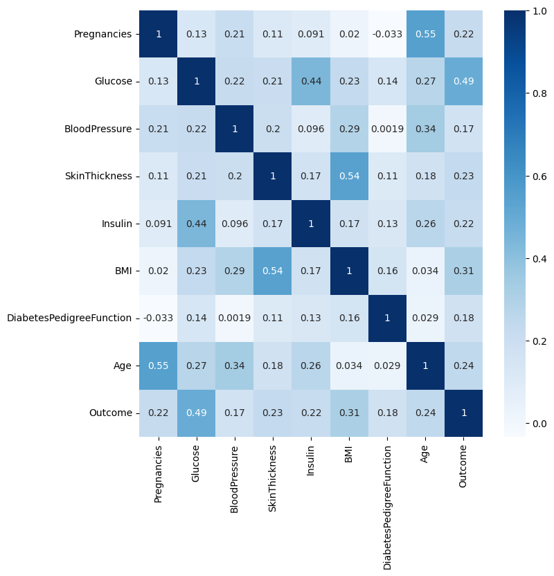
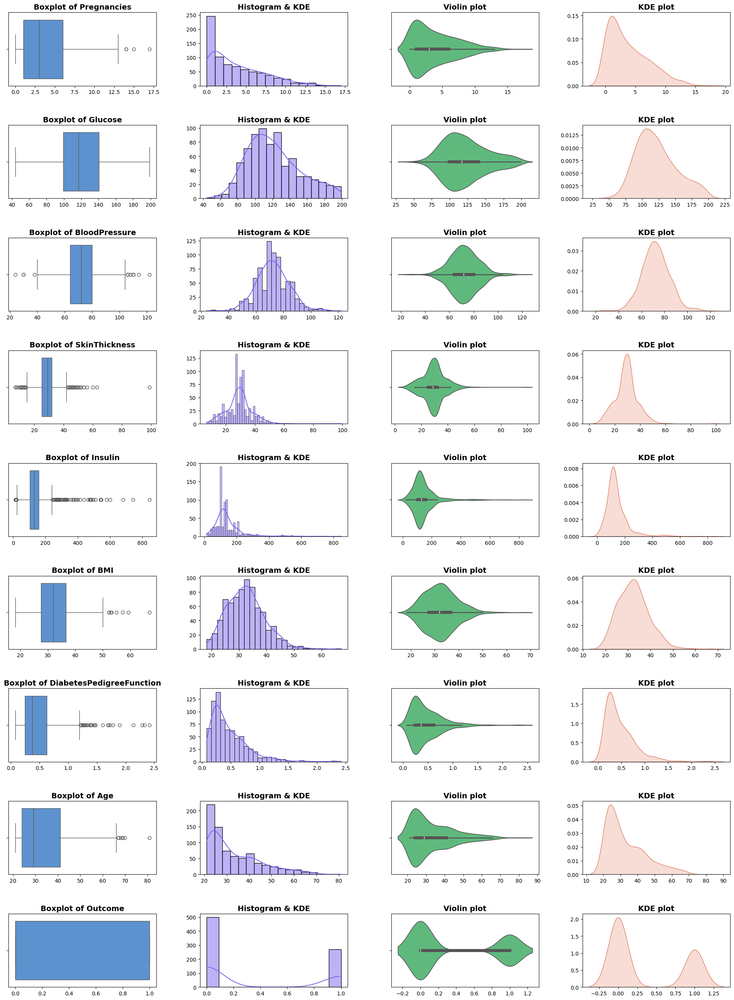
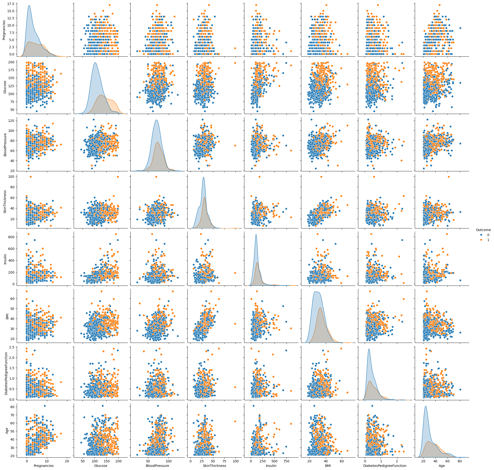
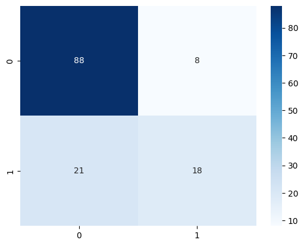

# 🩺 Diabetes Prediction - Exploratory Data Analysis (EDA)

This project focuses on performing **Exploratory Data Analysis (EDA)** on a diabetes dataset to uncover patterns, trends, and insights that can support prediction models and medical understanding. It includes detailed data preprocessing, visualization, and statistical summary techniques implemented in a Jupyter Notebook.

---

## 📁 Files in This Repository

- `Diabetes.ipynb`: The main Jupyter Notebook where all the EDA is performed.
- `README.md`: Documentation for the repository.

---

## 📊 Dataset Description

The dataset contains medical information related to female patients of at least 21 years old of Pima Indian heritage. It includes the following features:

- **Pregnancies** – Number of times pregnant
- **Glucose** – Plasma glucose concentration
- **BloodPressure** – Diastolic blood pressure (mm Hg)
- **SkinThickness** – Triceps skin fold thickness (mm)
- **Insulin** – 2-Hour serum insulin (mu U/ml)
- **BMI** – Body mass index (weight in kg/(height in m)^2)
- **DiabetesPedigreeFunction** – A function which scores likelihood of diabetes based on family history
- **Age** – Age of the patient
- **Outcome** – Class variable (0 or 1) indicating whether the patient has diabetes

---

## 🔍 EDA Highlights

The notebook includes:

- Data Cleaning (e.g., handling zero values, missing data)
- Data Visualization using:
  - Histograms
  - Boxplots
  - Heatmaps
  - Pairplots
- Statistical Analysis:
  - Correlation Matrix
  - Group-wise comparison
- Feature Engineering:
  - Age Group categorization
- Data Imputation Techniques for zero-replacement in specific columns

---

## 🧠 Insights & Learnings
- High correlation between glucose level and diabetes outcome.

- Zero values in features like blood pressure, insulin, and BMI can mislead models and need treatment.

- Age and BMI categories can be useful for feature engineering.

- Visualizations reveal class imbalance and possible data skewness.

---
## 📷 Visual Examples
- Heat map for correlation among features.

- Boxplot, Histograph, Violin and KDE graph to analyze the distribution of data.

- Plotting the pair graph to analyze the data distribution on the basis of outcome.

- Confusion matrix.

