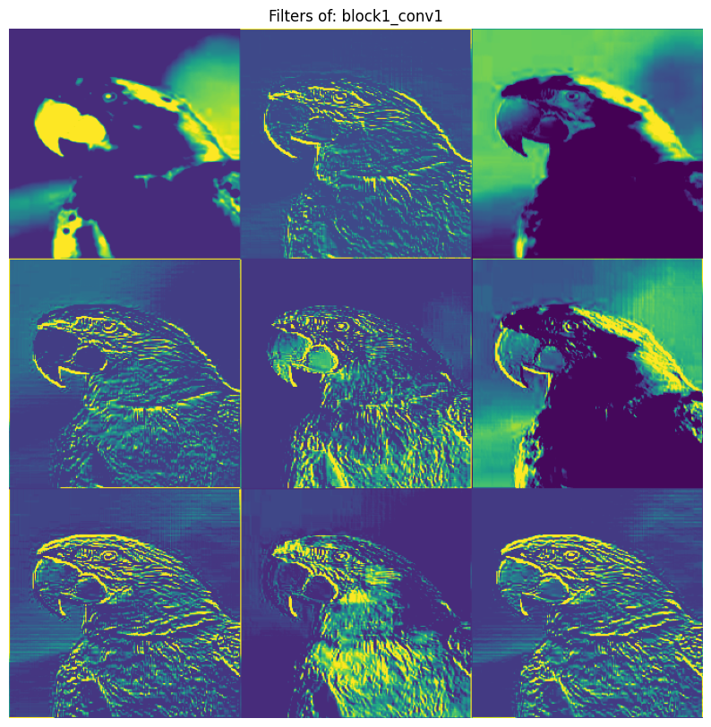
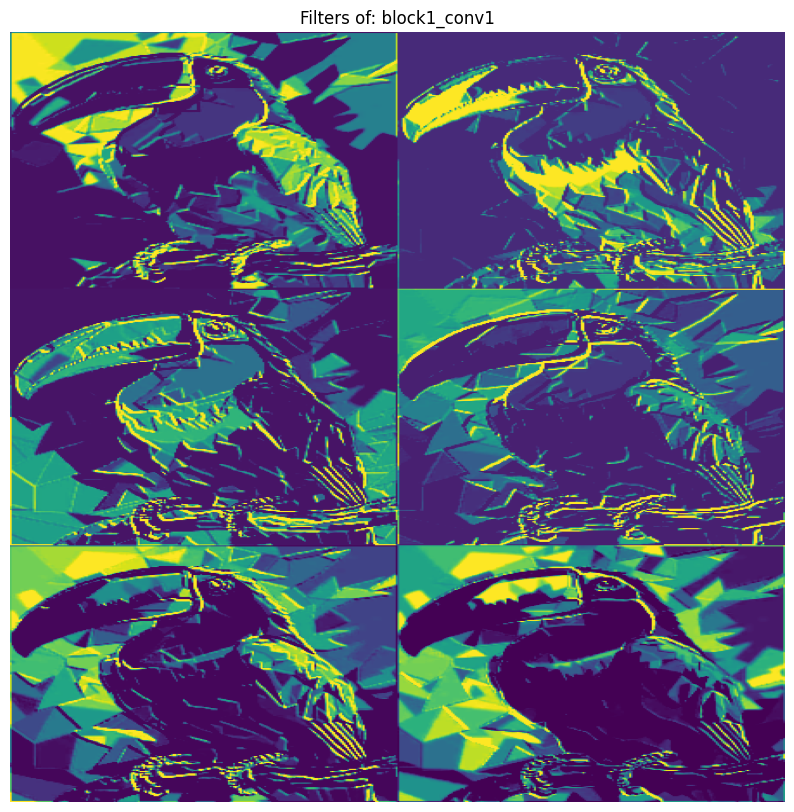

# Neural Style Transfer using TensorFlow

> Transform your photos into artistic masterpieces by merging **content** and **style** through deep learning.

---

## Overview

This project demonstrates **Neural Style Transfer (NST)** implemented with **TensorFlow** and **TensorFlow Hub**.
It blends the **content** of one image with the **artistic style** of another to produce creative, stylized artwork.

The notebook `Neural_Style_Transfer.ipynb` walks through every step — from loading images to visualizing CNN activations.

---

## Example Outputs

Here are some examples generated in the notebook 👇


> 📸 Each triplet visualizes the input content, reference style, and final stylized result.

---

## Features

- Apply **TensorFlow Hub’s pre-trained NST model**
- Stylize **any pair of content and style images**
- Visualize **CNN filter activations** and intermediate feature maps
- Support for **multiple image pairs** in one run
- Generate **high-resolution stylized images**

---

## Tech Stack

- **TensorFlow** & **TensorFlow Hub** – deep learning and pretrained NST models
- **Matplotlib**, **NumPy**, **OpenCV** – visualization and image processing
- **Keras Preprocessing** – for image handling

---

## How It Works

1. **Preprocess** both content and style images (resize, scale, normalize).
2. **Extract** content and style features using a pre-trained CNN.
3. **Blend** the two representations using a neural optimization process.
4. **Generate** the final stylized output.
5. **Visualize** feature activations to understand CNN behavior.

---

## Notebook Structure

| Section | Description |
|----------|--------------|
| **1. Imports & Setup** | Load TensorFlow, TF Hub, and utilities |
| **2. Image Preprocessing** | Load, resize, and prepare images |
| **3. Model Loading** | Load TensorFlow Hub’s NST model |
| **4. Stylization Function** | Combine content and style tensors |
| **5. Visualization** | Compare input and output images |
| **6. CNN Feature Maps** | Display filters (e.g., `block1_conv1`) |

---

## Installation

```bash
# Clone this repository
git clone https://github.com/<your-username>/Neural-Style-Transfer.git
cd Neural-Style-Transfer

# Install dependencies
pip install tensorflow tensorflow_hub matplotlib numpy opencv-python
```

---

## Run

```bash
jupyter notebook Neural_Style_Transfer.ipynb
```

Replace the paths of your own images in the notebook (for example):

```python
content_image_path = "images/my_photo.jpg"
style_image_path = "styles/starry_night.jpg"
```

---

## CNN Filter Visualization

Example visualization of **`block1_conv1`** layer filters applied to the content image:

<h3> Content Image Visualization </h3>



<h3> Style Image Visualization </h3>



Each grid shows how the CNN extracts edges, shapes, and patterns.

You can see in Notebook.

---

## Results

- Early layers capture **edges and textures**
- Deeper layers capture **content and structure**
- NST merges both to produce **artistic stylizations**

---

## Acknowledgments

- [TensorFlow Hub NST Tutorial](https://www.tensorflow.org/tutorials/generative/style_transfer)

---

## License

This project is licensed under the **MIT License** — free for use and modification.
